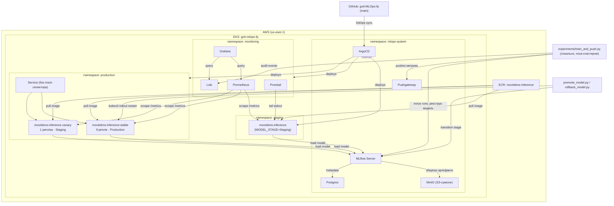
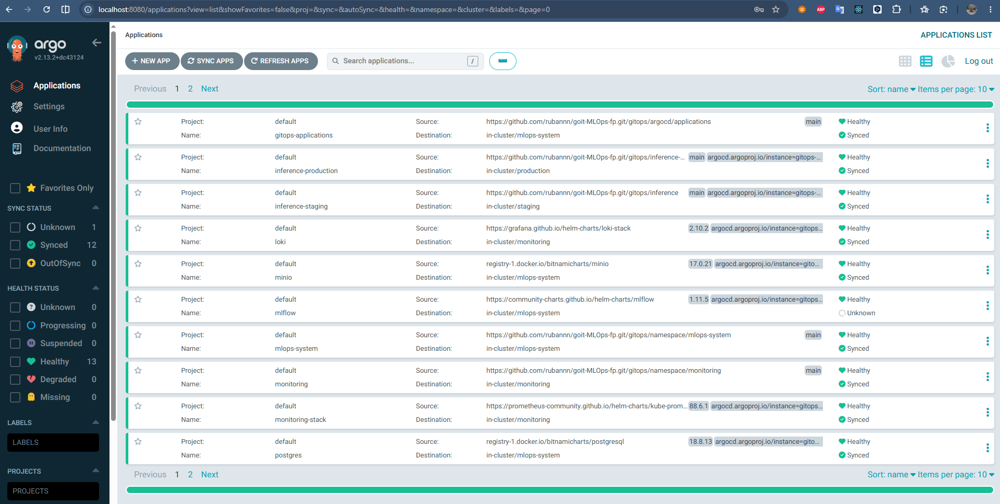
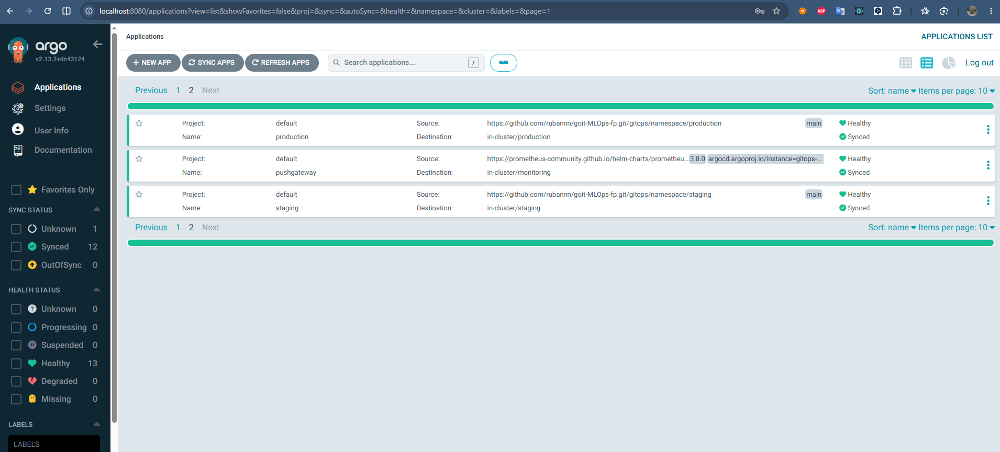
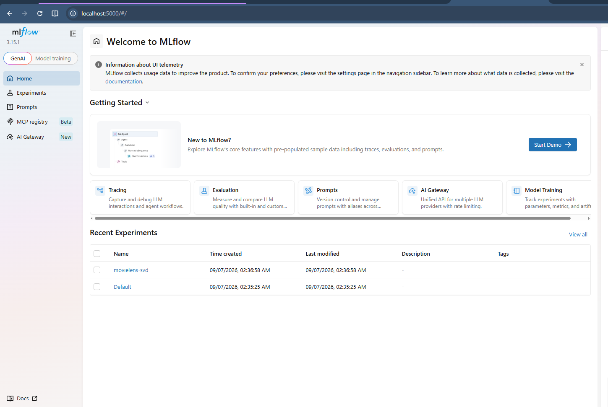
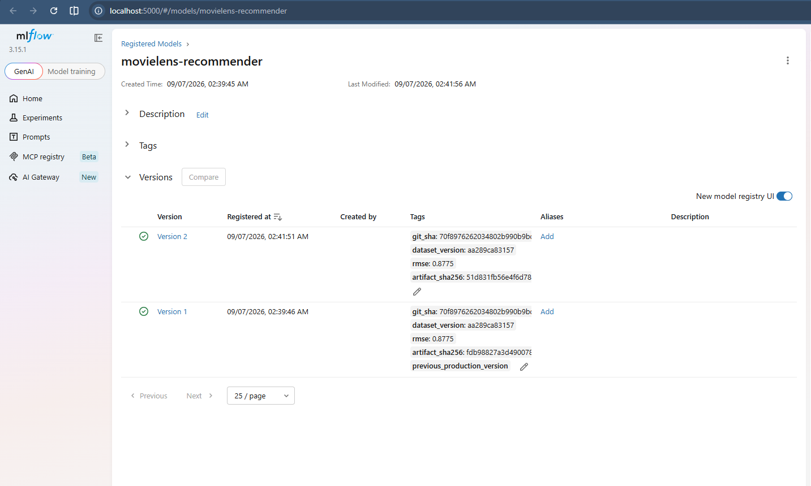
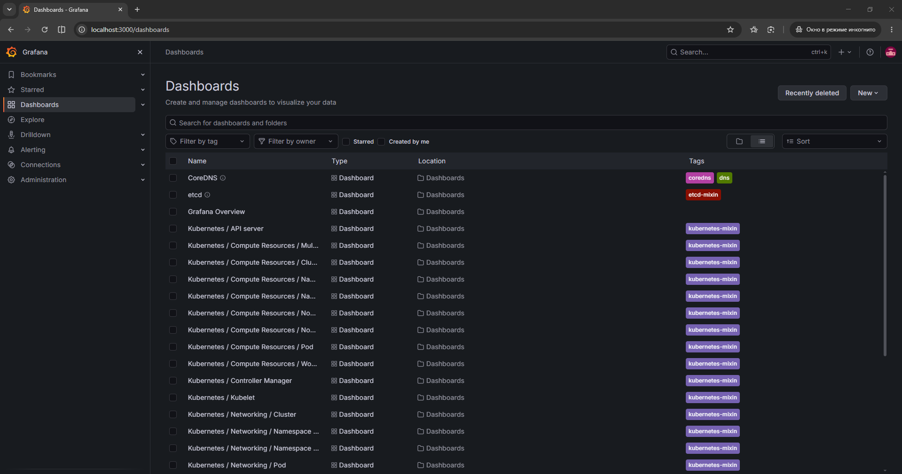
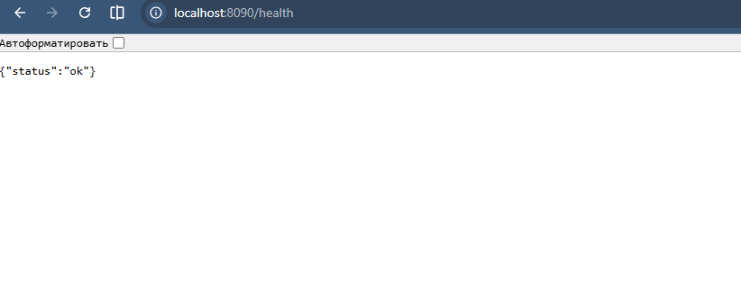
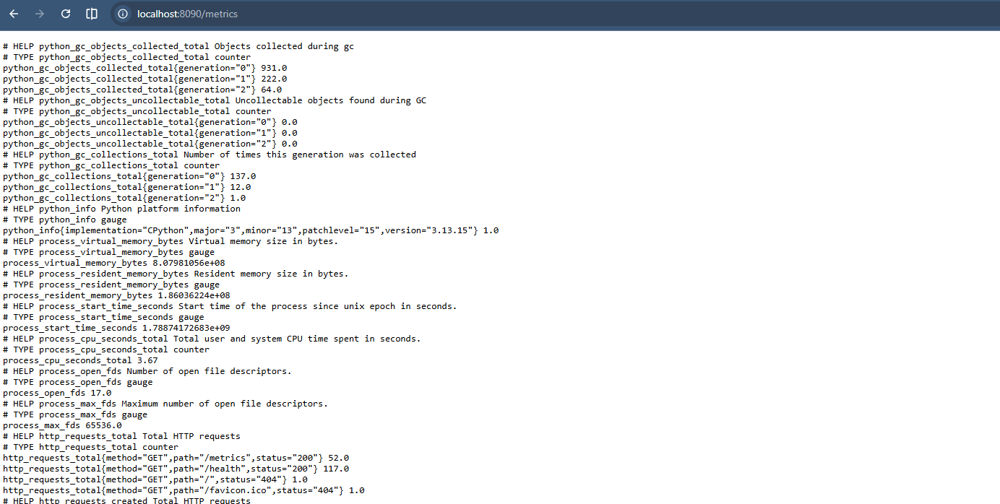

# goit-MLOps-fp

MLOps-платформа на AWS EKS: Terraform-інфраструктура, ArgoCD (GitOps), MLflow Model Registry, Canary-деплой моделі рекомендацій (MovieLens), моніторинг та security baseline.

**Документація:** [RUNBOOK.md](RUNBOOK.md) (операційні процедури) · [THREAT_MODEL.md](THREAT_MODEL.md) (загрози й контролі) · [ADR.md](ADR.md) (обґрунтування deployment-стратегії)

## Структура: один репозиторій

Весь проєкт — Terraform, GitOps-маніфести, training/inference-код, RBAC, документація — свідомо в **одному** репозиторії (`goit-MLOps-fp`), а не розбитий на кілька (напр. окремо infra / okремо app-код):

- Усі частини мають спільний життєвий цикл і версіонуються разом — зміна моделі, деплойменту й інфраструктури часто йдуть в одному коміті (напр. новий образ inference-сервісу + оновлений Deployment-маніфест).
- ArgoCD і так тягне GitOps-маніфести з цього самого репозиторію (`gitops_repo_url` у `terraform/argocd/variables.tf`) — розділення на кілька репо ускладнило б bootstrap без реальної користі для проєкту такого розміру.

## Модель і дані

- **Датасет:** [MovieLens ml-latest-small](https://grouplens.org/datasets/movielens/) (GroupLens Research) — публічний, ~100 000 рейтингів, ~9 000 фільмів.
- **Задача:** рекомендаційна система (Matrix Factorization).
- **Deployment-стратегія:** Canary (90/10) — детальне обґрунтування в [ADR.md](ADR.md) (Блок D), коротко:
  - Домен low-stakes (рекомендація фільму, не медичне/фінансове рішення) — безпечно пускати частину живого трафіку на неперевірену модель.
  - Реалізація: `production` namespace містить 2 Deployment за одним Service без `track` у селекторі — `movielens-inference-stable` (9 реплік, модель зі стадії **Production**) і `movielens-inference-canary` (1 репліка, модель зі стадії **Staging** — наступний кандидат). Оскільки Service балансує по всіх подах, що збігаються з лейблом `app: movielens-inference`, розподіл трафіку визначається співвідношенням кількості реплік (9:1 ≈ 90/10), без Ingress-контролера чи service mesh.
  - Перевірено наживо: 259 запитів через ClusterIP Service → 87.6% stable / 12.4% canary (очікувані статистичні відхилення від 90/10 через малу кількість подів і random-балансинг kube-proxy).
  - Promotion (`experiments/promote_model.py`) і rollback (`experiments/rollback_model.py`) — окремі, явні дії, не автоматичні; rollback перевірено практично ([RUNBOOK.md](RUNBOOK.md), Блок D2).

## Архітектура



## Структура репозиторію

```
terraform/
  vpc/                     — мережа (VPC, subnets)
  eks/                     — EKS-кластер
  argocd/                  — bootstrap ArgoCD (Helm) + ApplicationSet/Application, що тягнуть gitops/
gitops/
  namespace/               — по одному Application на namespace (staging, production, mlops-system, monitoring)
  argocd/applications/     — ArgoCD Application-маніфести сервісів (MLflow, MinIO, Postgres, Pushgateway, monitoring-stack, Loki, inference-staging, inference-production)
  inference/               — K8s-маніфести inference-сервісу для staging (Deployment, Service, ServiceMonitor, Grafana dashboard ConfigMap)
  inference-production/    — те саме для production (2 Deployment — stable/canary — за одним Service, ServiceMonitor)
experiments/
  train_and_push.py        — тренування SVD-моделі, реєстрація в MLflow, checksum, audit-подія
  promote_model.py         — Staging → Production (окрема дія)
  rollback_model.py        — rollback однією командою
  audit_log.py             — пуш структурованих audit-подій у Loki
  data/                    — MovieLens ratings.csv / movies.csv
inference/
  app/                     — FastAPI inference-сервіс (main.py, model.py, schemas.py, logging_config.py)
  Dockerfile
rbac/                      — Role/RoleBinding (mlops-engineer), ClusterRole/ClusterRoleBinding (viewer)
RUNBOOK.md                 — операційні процедури (promote, rollback, troubleshooting, teardown)
THREAT_MODEL.md            — 5 загроз і контролі, що їх знижують
ADR.md                     — обґрунтування deployment-стратегії, trade-off-и
```

Кожен файл під `terraform/*/backend.tf` вказує на окремий шлях у спільному S3-бакеті стану (`fp/vpc/...`, `fp/eks/...`, `fp/argocd/...`) — ізольовано від state попередніх ДЗ у тому ж бакеті.

## Namespace-и (EKS)

| Namespace | Призначення |
|---|---|
| `mlops-system` | Платформний інструментарій: ArgoCD, MLflow, MinIO, Postgres, Pushgateway |
| `monitoring` | Prometheus, Grafana, Loki (kube-prometheus-stack) |
| `staging` | Inference-сервіс — нова версія моделі перед промоушеном |
| `production` | Inference-сервіс — production-версія моделі, Canary-трафік |

## Розгортання з нуля (bootstrap-фази)

Bootstrap виконується у явних фазах — послідовність обов'язкова, кожна фаза залежить від попередньої.

### Передумови

Версії, на яких фактично перевірено розгортання цього репозиторію:

| Інструмент | Версія |
|---|---|
| Terraform CLI | 1.9.8 (вимога проєкту: ≥ 1.5) |
| AWS CLI | 2.36.23 |
| kubectl | 1.36.1 |
| Docker | 29.6.2 (для збірки `inference/Dockerfile`) |
| Python | 3.13 (для `experiments/*.py`) |

- AWS CLI, налаштований профіль `goit-terraform` з доступом до акаунту
- Існуючий S3-бакет `mlops-tfstate-goit-512523811086` і DynamoDB-таблиця `mlops-tfstate-lock` (спільні для всіх ДЗ цього акаунту — вже створені раніше)
- ECR-репозиторій `movielens-inference` (створюється один раз: `aws ecr create-repository --repository-name movielens-inference --region us-east-1 --profile goit-terraform`)

### Фаза 1 — мережа і кластер (Terraform)

```bash
cd terraform/vpc
terraform init
terraform apply

cd ../eks
terraform init
terraform apply
```

Перевірка:
```bash
aws eks update-kubeconfig --name <cluster_name> --region us-east-1 --profile goit-terraform
kubectl get nodes
```

### Фаза 2 — ArgoCD (Terraform + Helm)

```bash
cd ../argocd
terraform init
terraform apply
```

Це піднімає namespace `mlops-system`, встановлює ArgoCD через Helm і створює:
- `ApplicationSet` `gitops-namespaces`, що синхронізує все з `gitops/namespace/*` (по одному Application на namespace)
- `Application` `gitops-applications`, що синхронізує все з `gitops/argocd/applications` (сервіси)

> ⚠️ Відома проблема: CRD ArgoCD з'являються лише після встановлення Helm-релізу — на чистому кластері `kubernetes_manifest` для `ApplicationSet`/`Application` може впасти з першої спроби. Якщо так — повторний `terraform apply` після появи CRD вирішує проблему (в коді це враховано через `depends_on = [helm_release.argocd]`, але timing CRD registration інколи вимагає повторного запуску).

Перевірка:
```bash
kubectl get pods -n mlops-system
kubectl port-forward svc/argocd-server -n mlops-system 8080:443
# ArgoCD запущено з --insecure (argocd-values.yaml) — відкрити http://localhost:8080 (НЕ https), логін admin / (пароль з kubectl -n mlops-system get secret argocd-initial-admin-secret -o jsonpath="{.data.password}" | base64 -d)
```

### Фаза 2.5 — секрети (одноразово, вручну, поза Git)

MinIO/Postgres/MLflow читають креденшели з Kubernetes Secret, а не з git (див. [THREAT_MODEL.md](THREAT_MODEL.md)). Створіть їх **до** Фази 3, з власними паролями (не використовуйте наведені нижче як приклад):

```bash
for ns in mlops-system staging production; do
  kubectl create secret generic minio-credentials -n $ns \
    --from-literal=root-user=minioadmin \
    --from-literal=root-password="$(openssl rand -base64 24)"
done

kubectl create secret generic postgres-credentials -n mlops-system \
  --from-literal=postgres-password="$(openssl rand -base64 24)" \
  --from-literal=username=mlflow \
  --from-literal=password="$(openssl rand -base64 24)"
```

> ⚠️ `minio-credentials` має бути **однаковим** у всіх трьох namespace (`root-user`/`root-password` збігаються) — MinIO в `mlops-system` і inference-поди в `staging`/`production` мають користуватись одним і тим самим набором ключів для доступу до S3-артефактів. Postgres-креденшели потрібні лише в `mlops-system` (там же живе і сам Postgres, і MLflow).

### Фаза 3 — решта сервісів (через ArgoCD, GitOps)

Нічого руками запускати не треба — ArgoCD автоматично підхоплює `gitops/argocd/applications/*.yaml` і розгортає MLflow, MinIO, Postgres, Pushgateway (у `mlops-system`) та monitoring-stack (у `monitoring`).

Перевірка:
```bash
kubectl get applications -n mlops-system
# усі мають бути Synced / Healthy
```

### Доступ до сервісів

Усі сервіси доступні лише через port-forward (обґрунтування: без публічного Ingress/DNS для навчального проєкту — простіше й безпечніше для тимчасово піднятої на ~24 год інфраструктури). Кожна команда — в окремому терміналі, тримати відкритою, поки потрібен доступ:

```bash
kubectl port-forward svc/argocd-server -n mlops-system 8080:443       # http://localhost:8080 (insecure-режим — не https)
kubectl port-forward svc/mlflow -n mlops-system 5000:5000             # http://localhost:5000
kubectl port-forward svc/monitoring-stack-grafana -n monitoring 3000:80  # http://localhost:3000, admin / (kubectl get secret monitoring-stack-grafana -n monitoring -o jsonpath="{.data.admin-password}" | base64 -d)
kubectl port-forward svc/movielens-inference -n staging 8000:80       # http://localhost:8000 — canary-кандидат (Staging)
kubectl port-forward svc/movielens-inference -n production 8090:80    # http://localhost:8090 — 90/10 stable/canary
```

## Demo-trace

| | |
|---|---|
| **ArgoCD — усі Applications Synced/Healthy** (стор. 1) |  |
| **ArgoCD — усі Applications Synced/Healthy** (стор. 2) |  |
| **MLflow — головна сторінка, experiment `movielens-svd`** |  |
| **MLflow Model Registry — `movielens-recommender`, stage=Production** |  |
| **Grafana-дашборд "MovieLens Inference Service" (інкогніто)** |  |
| **Production inference — `/health`** |  |
| **Production inference — `/metrics` (Prometheus scrape target)** |  |

## Прибирання ресурсів (після кожної робочої сесії)

```bash
cd terraform/argocd && terraform destroy
cd ../eks && terraform destroy
cd ../vpc && terraform destroy
```

## Контроль
```bash
aws eks list-clusters --region us-east-1 --profile goit-terraform
aws ec2 describe-vpcs --region us-east-1 --profile goit-terraform --filters "Name=tag:Name,Values=*goit-mlops-fp*"
```


## Відомі обмеження

- **Rate limiting — per-под, не кластерний.** Лічильник живе в пам'яті кожного поду окремо (немає Redis чи shared store), тому ефективна межа масштабується з кількістю реплік. Задокументовано в [THREAT_MODEL.md](THREAT_MODEL.md).
- `mlops-system` namespace створюється двічі за задумом: спочатку напряму Terraform-ом (`kubernetes_namespace.argocd` — потрібен до встановлення самого ArgoCD, класична проблема "курки і яйця"), потім ще раз декларативно через `gitops/namespace/mlops-system/ns.yaml` під управлінням ArgoCD (ідемпотентно, конфлікту не викликає, ArgoCD просто бере existing namespace під GitOps-управління).
